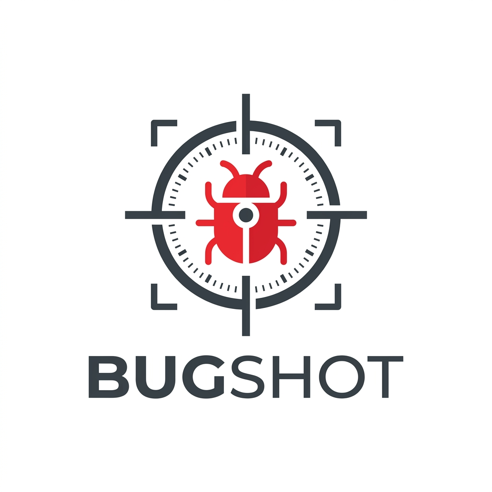
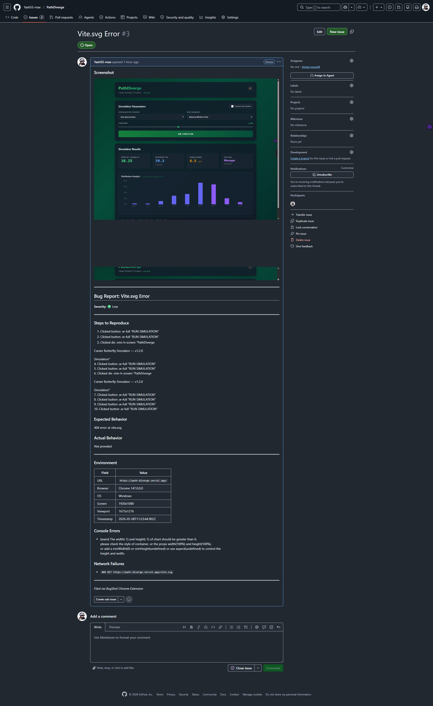

<p align="center">
  
</p>

<h1 align="center">BugShot</h1>

<p align="center">
  <strong>Capture, annotate, and file bug reports to GitHub in one click.</strong><br/>
  A Chrome extension (Manifest V3) designed to streamline the bug-reporting workflow for QA teams and developers.
</p>

<p align="center">
  
  
  
  
</p>

---

## Introduction

BugShot is a Chrome extension that lets developers capture, annotate, and file bug reports directly to GitHub Issues in one workflow — without switching tabs, copying URLs, or manually writing environment details.

---

## Table of Contents

- [Introduction](#introduction)
- [Visual Overview](#visual-overview)
- [Core Features](#core-features)
- [Automated Report Data](#automated-report-data)
- [DevTools Panel](#devtools-panel)
- [GitHub Integration](#github-integration)
- [UX Details](#ux-details)
- [Architecture](#architecture)
- [Setup](#setup)
- [How Screenshots Are Attached](#how-screenshots-are-attached)
- [Known Limitations](#known-limitations)
- [Permissions Used](#permissions-used)

---

## Visual Overview

### 1. Capture and Annotate
Highlight issues using the integrated drawing suite. Support for rectangles, arrows, and text notes with built-in cropping capabilities.


### 2. Bug Report Form
The extension automatically populates environment metadata, recorded steps, and console logs into a structured form.


### 3. Generated GitHub Issue
One-click submission creates a standardized issue in the target repository with embedded screenshots and technical metadata.



---

## Core Features

### Screenshot Capture
- **Viewport Capture**: Capture the visible viewport with one click.
- **Full-Page Capture**: Automated scrolling and stitching of tiles into a single high-resolution image.
- **Crop Tool**: Drag-select any region of the screenshot before starting the annotation process.
- **Annotation Suite**: Freehand pen, rectangle, arrow, and text labels.
- **Color Selection**: Four professional colors (Red, Yellow, Blue, White).
- **History Control**: Per-stroke undo and a clear-all function to revert to the original capture.
- **Console Screenshot**: Optional secondary capture with a 3-second countdown to facilitate capturing DevTools.

---

## Automated Report Data

- **Steps to Reproduce**: Automatically records the last 20 user interactions (clicks with element descriptions, SPA navigations) to populate report steps.
- **Console Capture**: Intercepts console errors, warnings, and unhandled promise rejections from the page's main JavaScript context.
- **Network Failure Capture**: Monitors 4xx/5xx responses and connection errors from both fetch and XMLHttpRequest.
- **Environment Metadata**: Automatically collects URL, browser version, OS, screen resolution, viewport size, and timestamp.

---

## DevTools Panel

BugShot includes a dedicated tab within Chrome Developer Tools:
- **Live Monitoring**: Displays console errors and network failures as they occur.
- **Native Integration**: Utilizes the network request API for real-time data inspection.
- **Background Sync**: Data auto-syncs to the background worker every 2 seconds to ensure the popup is always current.
- **One-Click Filing**: Includes a button to save all current session logs for the next report.


---

## GitHub Integration

- **Direct API Submission**: Submits issues directly to GitHub via the REST API using a Personal Access Token.
- **Screenshot Storage**: Uploads annotated images to a `.bugshot/` directory in the target repository.
- **Rich Markdown Formatting**: Issue bodies include screenshots, severity indicators, reproduction steps, environment tables, and error sections.

---

## UX Details

- **Responsive Inputs**: All text fields automatically resize as the user types.
- **Persistence**: Extension settings are persisted across browser sessions via local storage.
- **Status Notifications**: Integrated toast notifications for confirmation of success or detailed error reporting.
- **Synchronous Undo**: The annotation canvas uses image data snapshots to ensure reliable undo operations without race conditions.

---

## Architecture

```text
manifest.json          — MV3, declares devtools_page, content_scripts, background
background.js          — Service worker: tab capture, full-page stitch, GitHub API, data bridge
content/content.js     — Isolated world: click/nav recording, message handler, sessionStorage reader
content/main_world.js  — Main world (injected): console + fetch/XHR interception
devtools/devtools.js   — DevTools context: panel creation, network monitoring, sessionStorage sync
devtools/panel.html/js — BugShot tab UI inside DevTools
popup/popup.html/css/js — Main extension UI: capture, annotate, crop, report form, settings
```

---

## Setup

1. **Clone the Repository**:
   ```bash
   git clone https://github.com/Yash55-max/BugShot.git
   ```
2. **Load the Extension**:
   - **Microsoft Edge**: Navigate to `edge://extensions`, enable **Developer mode**, and click **Load unpacked**.
   - **Google Chrome**: Navigate to `chrome://extensions`, enable **Developer mode**, and click **Load unpacked**.
   - Select the `bugreport-ext` directory from the cloned repository.
3. **Configuration**:
   - Open the **Settings (Gear Icon)** in the BugShot popup.
   - Provide a **GitHub Personal Access Token** with `repo` scope.
   - Enter the target **GitHub Owner** and **Repository Name**.

---

## How Screenshots Are Attached

BugShot commits screenshots as PNG files into a `.bugshot/` directory in your repository using the Contents API. The resulting download URL is embedded as a standard markdown image in the issue body. 

*Note: You may add `.bugshot/` to your `.gitignore` to keep the repository clean while allowing images to render correctly in GitHub issues.*

---

## Known Limitations

- **Script Blocking**: Console capture may be limited on pages that entirely block extension script injection (e.g., highly restrictive CSPs).
- **Fixed Headers**: Full-page capture uses tile stitching; pages with fixed headers may show repetition at tile boundaries.
- **DevTools Initialization**: If the extension is reloaded, DevTools must be closed and reopened once to reinitialize the BugShot panel.
- **Viewport Visibility**: Console Screenshot captures the visible tab viewport and works most effectively when DevTools is docked.

---

## Permissions Used

| Permission | Reason |
|---|---|
| `activeTab` | Required to capture the current tab screenshot. |
| `scripting` | Used to inject the main-world script for console and network capture. |
| `tabs` | Necessary for full-page scroll capture and tab information. |
| `storage` | Used to persist GitHub settings and credentials locally. |
| `host_permissions: <all_urls>` | Allows injection of content scripts across different domains. |
| `host_permissions: api.github.com` | Required to submit issues and upload images to GitHub. |
